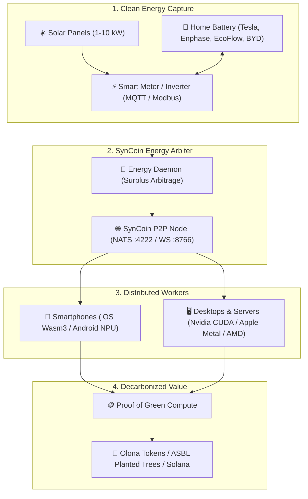

# SynCoin 🌱 — Universal Decarbonized AI Compute Network

**Transform your solar surplus, residential batteries, and idle smartphones into a green, decentralized AI supercomputer.**

[](LICENSE)
[](syncoin_node.py)
[](ios/)
[](https://nats.io)
[](contracts/)
[](CONTRIBUTING.md)

SynCoin is a **100% Free & Open-Source (MIT)** decentralized compute network. It operates as a **Residential Micro-Neocloud** that unifies home solar panels, battery energy storage systems (BESS), desktop GPUs, and smartphones into a global, sovereign, and carbon-negative compute mesh.

---

## ⚡ The Core Problem & The SynCoin Solution

- **Cloud Saturation & Energy Bottleneck**: Centralized AI datacenters face 3 to 6-year grid connection delays and massive water consumption.
- **Wasted Solar & Battery Surplus**: Millions of homes generate fatal solar energy that is sold back to the grid at low rates.
- **The SynCoin Model (Energy-First Compute)**: Move the compute to where clean energy already exists (**Grid Bypass**). Monétisez votre surplus solaire ou batterie sous forme d'inférence IA utile pour la recherche, les universités et les modèles ouverts (Mistral, Llama, DeepSeek).

---

## 🏗️ Universal 4-Layer Architecture



---

## 🚀 Key Capabilities

1. **🔋 Residential Micro-Neocloud & Battery Arbitrage**:
   - Automatic detection of solar surplus ($P_{\text{solar}} - P_{\text{home}} > \text{threshold}$) via Home Assistant, MQTT, or Modbus.
   - Dynamic power modulation: AI inference kicks in when energy is green and free, and pauses when home needs electricity.
   - Battery Health Guard: Preserves battery cycle life and guarantees emergency power reserve ($>30\%$).

2. **📱 Smartphone Edge Compute (iOS & Android)**:
   - Zero-friction background computing via embedded **Wasm3 WebAssembly runtime** and Apple Silicon Neural Engine.
   - **Guaranteed Eco-Safeguards**: Executes **only** when plugged into AC power, fully charged, on WiFi, and thermally nominal.

3. **🔬 Useful Public-Good AI**:
   - SLM Inférence (Small Language Models: Qwen, SmolLM, Phi, Gemma).
   - Cetacean Bioacoustics & Marine Research (Zero-Supervision t-SNE / CETI project).
   - Climate modeling, medical R&D, and open science.

4. **🌱 Ecological Economics**:
   - **Olona Tokens**: Transparent compute contribution tracking.
   - **Tree Planting ASBL**: Automatic burning of Olona tokens to plant verified trees worldwide.

---

## 📦 Quick Start (Zero-Config)

### 1. Run the SynCoin Node & Energy Arbiter
```bash
# Clone the repository
git clone https://github.com/Boxxji/syncoin.git
cd syncoin

# Install dependencies
pip install -r requirements.txt

# Start the P2P Node with NATS & Energy Trigger
python3 syncoin_node.py --port 8766 --nats nats://localhost:4222
```

### 2. Run the Universal Worker (Any PC / Mac / Linux / Raspberry Pi)
```bash
# Connect your machine as a green compute worker
python3 syncoin_worker.py --server ws://localhost:8766 --auto-solar
```

### 3. iOS Native App (SwiftUI + Wasm3)
- Open `ios/SynCoin.xcodeproj` in Xcode.
- Run on any iPhone or iPad. It connects to the nearest Hub and automatically starts processing WASM micro-jobs when plugged into power!

---

## 📜 License & Open Source

This project is licensed under the **MIT License** — free and open for the entire world.

🌱 *For Lilo, for the world, for all of us. Built with love and sovereign green energy.*
