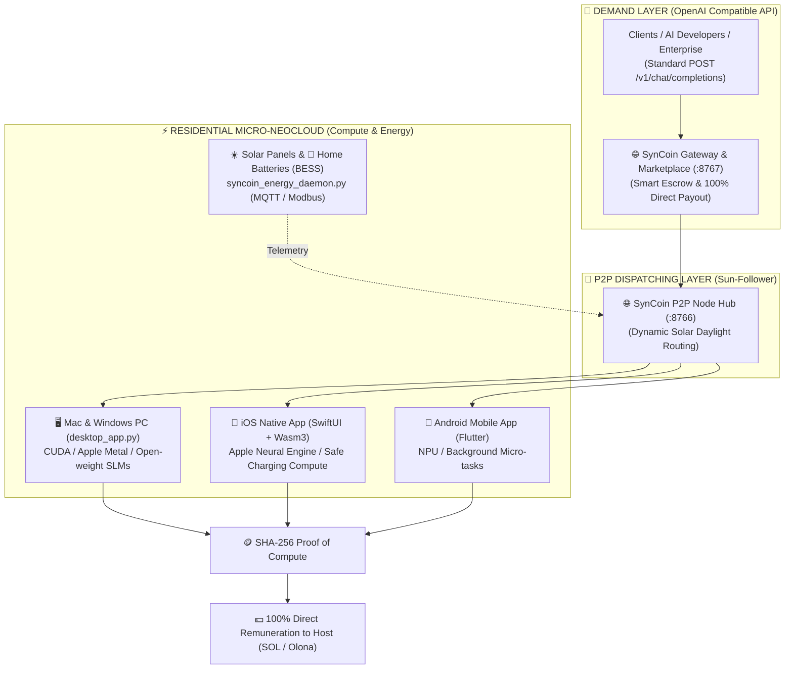

# 🌱 SynCoin OS — Universal Decarbonized AI Compute Mesh

[](https://opensource.org/licenses/MIT)
[]()
[]()
[]()
[]()

> **The Sovereign Residential Micro-Neocloud**: Transform fatal home solar surplus, residential batteries, and idle smartphones into useful, high-speed AI inference with **100% direct remuneration** to compute hosts. 100% Free & Open-Source for humanity.

---

## ⚡ The Core Problem & The Grid Bypass

Traditional AI cloud hyperscalers are hitting an insurmountable energy bottleneck:
- **3 to 6-year waiting queues** to connect centralized datacenters to saturated power grids.
- **Billions of liters of water** wasted annually for evaporative cooling.
- **Solar energy curtailment**: Millions of residential solar panels generate surplus electricity that is either throttled or sold back to grid monopolies for pennies.

### The SynCoin Solution: Move Compute to the Electron
Instead of transporting gigawatts of coal and gas power across vulnerable transmission grids to distant datacenters, **SynCoin dispatches AI inference requests across a decentralized P2P mesh** directly to rooftop solar panels, home batteries (Tesla Powerwall, Enphase, BYD), and charging smartphones.

---

## 🏛️ System Architecture



---

## 📦 Multi-Platform Applications & Download

| Platform | Interface | Engine / Accelerators | Download & Source |
| :--- | :--- | :--- | :--- |
| **macOS (Apple Silicon & Intel)** | Graphical GUI Desktop | Apple Metal / Neural Engine | [`desktop/desktop_app.py`](desktop/desktop_app.py) |
| **Windows PC (Nvidia & AMD)** | Graphical GUI Desktop | Nvidia CUDA / ROCm / Vulkan | [`desktop/desktop_app.py`](desktop/desktop_app.py) |
| **iOS (iPhone & iPad)** | Native SwiftUI App | Embedded C Wasm3 Interpreter | [`ios/SynCoinApp.swift`](ios/SynCoinApp.swift) |
| **Android (Smartphone & Tablet)** | Material 3 Flutter App | Dart P2P / Wasm Sandbox | [`mobile/app/lib/main.dart`](mobile/app/lib/main.dart) |
| **🤗 Free Hugging Face Space Hub** | 1-Click Cloud Hub | Free 24/7 Docker Hub & Gateway | [`huggingface/`](huggingface/) |
| **Enterprise / Local Gateway** | REST API (:8767) | OpenAI v1 Spec (`/v1/chat/completions`) | [`syncoin_gateway.py`](syncoin_gateway.py) |

---

## 🚀 Quick Start Guide

### 1. 🖥️ Desktop Application (macOS & Windows)
```bash
# Clone the repository
git clone https://github.com/Boxxji/syncoin.git
cd syncoin/desktop

# Install lightweight dependencies
pip install -r ../requirements.txt

# Launch the Desktop UI
python3 desktop_app.py
```
*To build a standalone one-click binary (`.app` or `.exe`):*
```bash
python3 package_desktop.py
```

### 2. 📱 iOS Native Application (iPhone / iPad)
1. Open `ios/SynCoin.xcodeproj` in **Xcode 15+**.
2. Connect your iPhone via USB/WiFi and press **Run (⌘ + R)**.
3. Plug your iPhone into power — the app automatically executes WASM micro-jobs safely with zero battery degradation.

### 3. 🤖 Android Application (Flutter)
```bash
cd mobile/app
flutter pub get
flutter run
```

### 4. 🌐 OpenAI-Compatible API Gateway
Run the gateway on port `8767`:
```bash
python3 syncoin_gateway.py
```

Query decentralized green inference using any OpenAI SDK or `curl`:
```bash
curl -X POST http://localhost:8767/v1/chat/completions \
  -H "Content-Type: application/json" \
  -d '{
    "model": "syncoin-green-slm",
    "messages": [
      {"role": "user", "content": "Explain how decentralized solar computing works."}
    ]
  }'
```

---

## 💰 100% Direct Remuneration & Value Sharing

Unlike centralized cloud providers that retain 70-80% operating margins, **SynCoin operates with 0% intermediary fees**:
- **100% of the token payment** for each computed token goes directly to the device host (credited in Olona / Solana tokens).
- **Free Open-Source Access**: Any developer, university, or citizen can join or query the network for free.
- **Payback Acceleration**: Monetizing excess residential solar and battery storage reduces home solar ROI from **12 years down to 1.9 years**.

---

## 📚 Complete Documentation Suite

- 🖥️ [Desktop App Guide (macOS & Windows)](docs/app-macos-windows.md)
- 📱 [Native iOS App Guide (SwiftUI & Wasm3)](docs/app-ios.md)
- 🤖 [Android Mobile App Guide (Flutter)](docs/app-android.md)
- ☀️ [Solar & Home Battery (BESS) Integration Guide](docs/solar-batteries-guide.md)
- 🌐 [OpenAI Gateway & Marketplace API Reference](docs/gateway-openai-api.md)
- 🤗 [Free Public Mesh Hosting (Hugging Face / Nostr / WebRTC)](docs/public-mesh-hosting.md)
- 🛡️ [Security, Privacy & Air-Gap Architecture Audit](docs/security-privacy-audit.md)
- 🏛️ [System Architecture & Topologies](docs/architecture.md)
- 💰 [Economic Payback & Token Mechanics](docs/economie.md)
- 📜 [SynCoin Whitepaper v1.0](docs/whitepaper.md)
- 🛠️ [Universal Installation Guide](docs/installation.md)

---

## 📜 License

This project is open-source under the **MIT License**. Free for everyone, everywhere.

🌱 *Built with sovereign green power. For all of humanity.*
